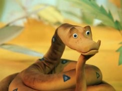

# 38parrots

web-based 3d visualization tool using cinemascience data files

# Examples

* [Reachable sets for Dubins car](http://tinyurl.com/w2bky2q) - IMM UrB RAS, [V.S. Patsko, A.A. Fedotov](http://sector3.imm.uran.ru/index_eng.html)
* [Examples from examples dir](http://tinyurl.com/ufq97ta)
* [Clean run](http://viewlang.ru/viewlang/code/scene.html?s=https://github.com/pavelvasev/38parrots/blob/master/result.vl)

# Usage

38parrots use [CinemaScience format](https://cinemasciencewebsite.readthedocs.io/en/latest/) which is brilliantly simple and powerful at the same time. 

38parrots provides support for 3d  artifacts. 

To visualize artifact of some type, use following column names for artifact: FILE_**type**_anystring. `examples` directory provides examples for that.

Following types are supported:
* vrml (merged to one object)
* obj (merged to one object)
* treki 
* points

After you prepared data files, open 38parrots and give it an URL of your data.csv file. 
You also may visualize local files using open file dialog -- in that case choose all files of cinemascience data directory.

# Credits

2020 (c) Pavel Vasev
